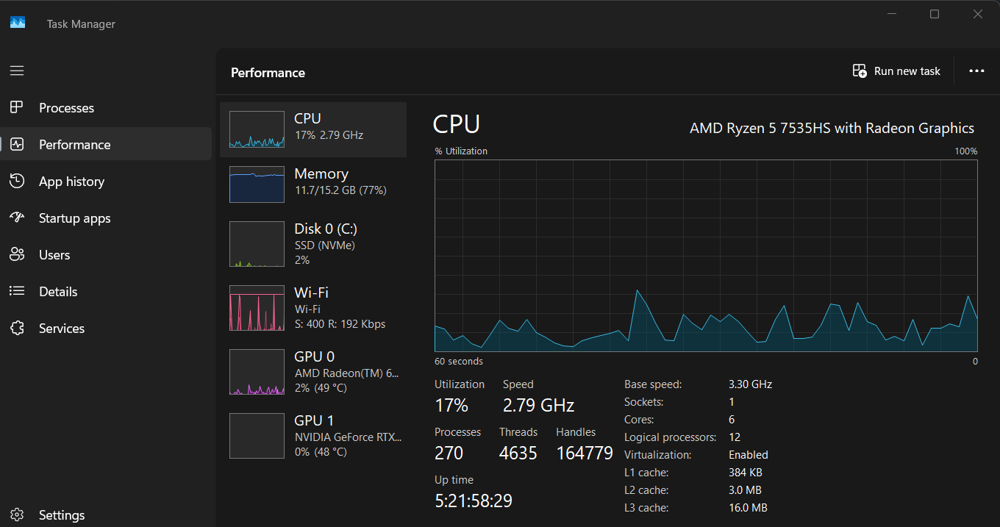
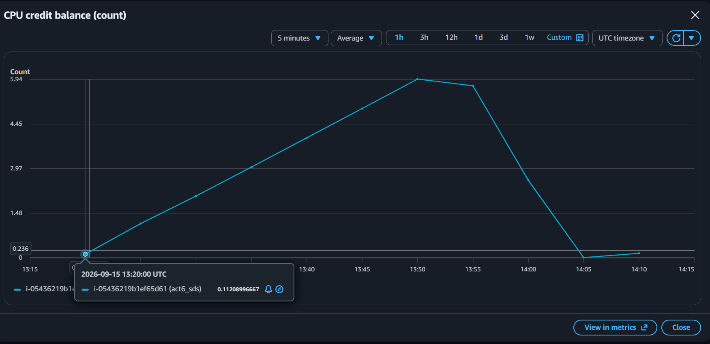
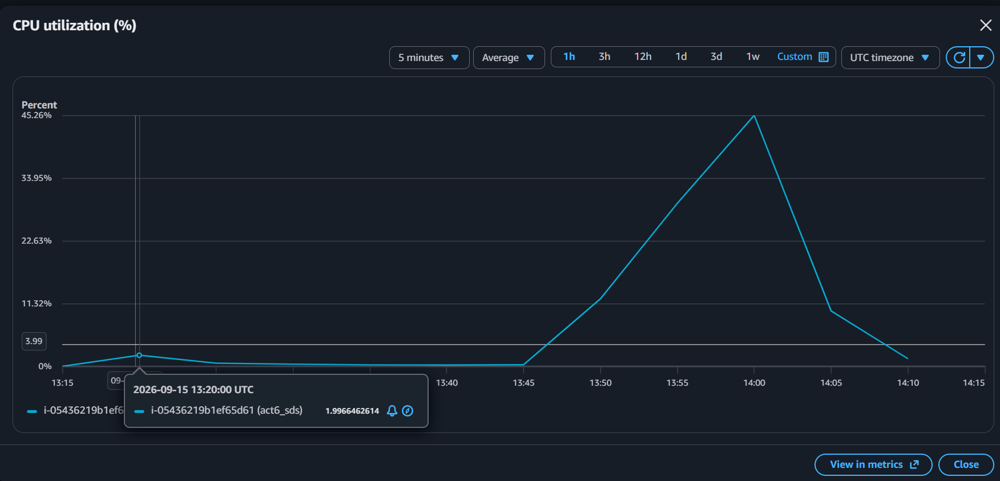
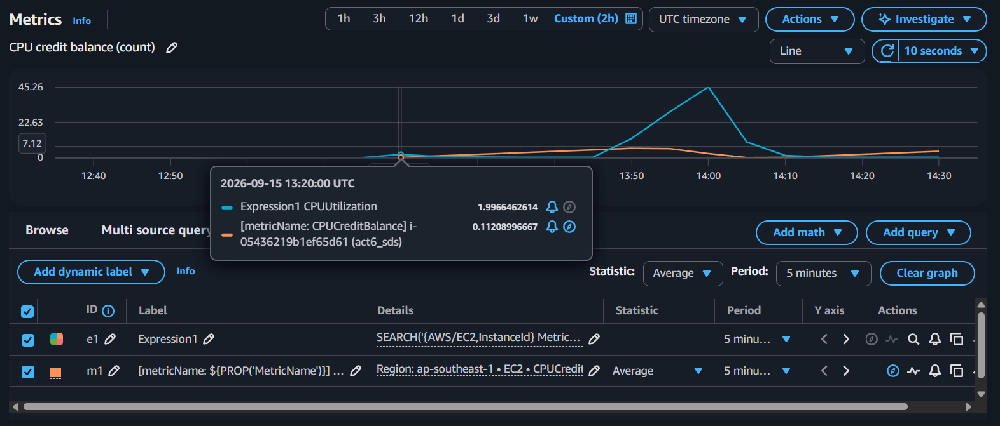
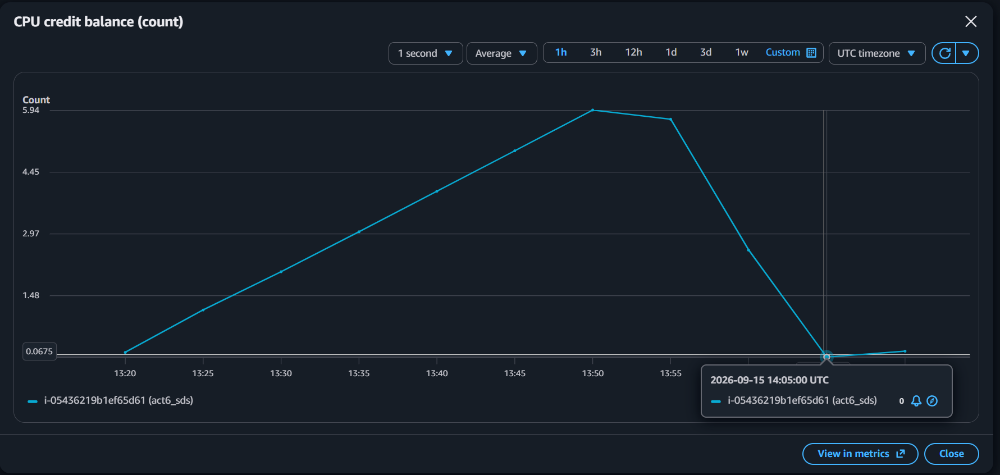
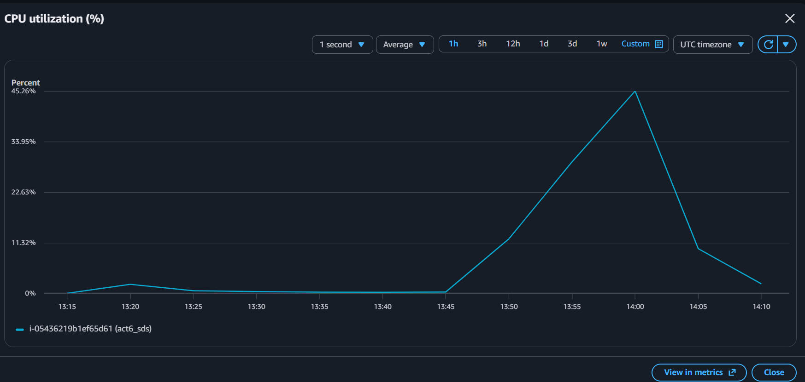
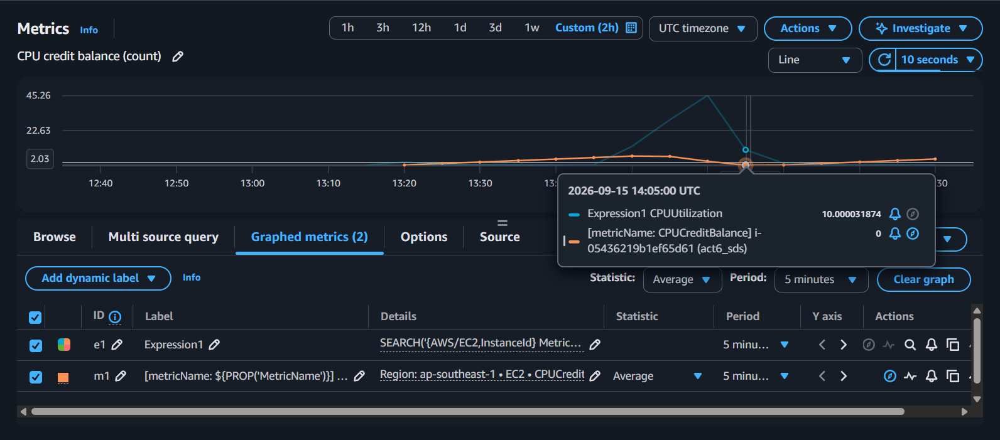
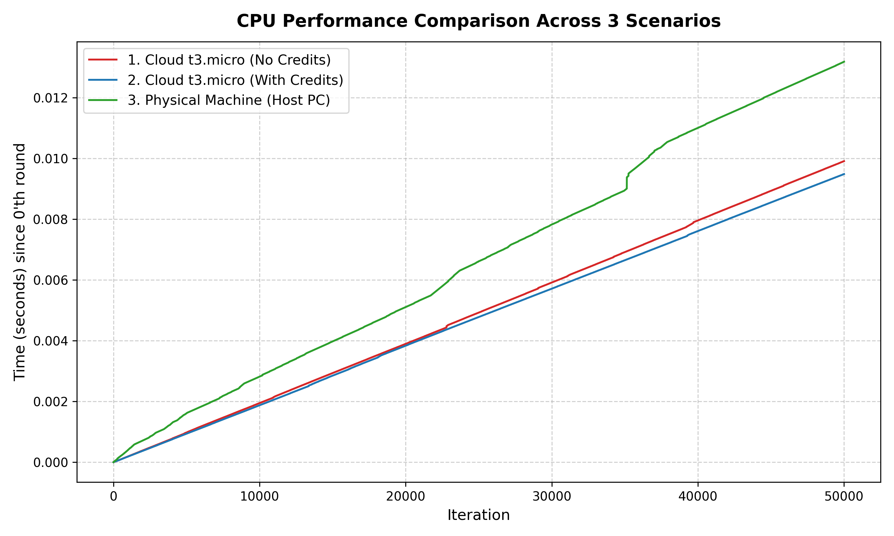

#### 1. Write cpu_test.py to measure CPU performance
Answer: 
```python
import time

l = [0 for _ in range(50001)]
for i in range(50001):
    l[i] = time.perf_counter_ns()
base = l[0]
for i in range(50001):
    l[i] = (l[i] - base)*(10**-9)
with open("result.txt", "w") as f:
    for idx, val in enumerate(l):
        f.write(f"{idx}, {val:.8f}")
        f.write("\n")
```

#### 2. Running cpu_test.py to collect CPU measurements
Answer: 
Host PC: 

EC2 with credit: 
Cpu Credit Balance


Cpu usage




EC2 without credit: 
Cpu Credit Balance


Cpu usage




#### 3. Comparison
Answer: 

| Scenario | 1. Cloud t3.micro Instance No Credits | 2. Cloud t3.micro Instance with Credits | 3. Your Physical Machine (Host PC) |
| :--- | :---: | :---: | :---: |
| **CPU Model and Speed (GHz)** | Intel Xeon 2.50 GHz | Intel Xeon 2.50 GHz | AMD Ryzen 5 7535HS 2.20 GHz |
| **Total time to run cpu_test.py (seconds)** | 0.00991012 | 0.00948534 | 0.01265120 |
| **Total time to run cpu_test.py (microseconds)** | 9,910.12 | 9,485.34 | 12,651.20 |


#### 4. Part 4: Answer these questions

##### 1. To understand how Clouds manage CPU resources

1.1. what is a CPU credit in AWS?
Answer: CPU Credit คือ Credit สำหรับการใช้งาน CPU บน Infrastrcture ของ Service EC2 ซึ่งใช้เพื่อกำหนด Performance ของ CPU ของ Infrastrcture Instance นั้นๆณ เวลานั้นๆ ถ้า Credit น้อย CPU ก็จะ utilize น้อยลง Credit เยอะก็จะรันได้เต็มประสิทธิภาพ

1.2. how does it benefit the Cloud user?
Answer:สำหรับผู้ใช้ Cloud ตามปกติไม่ได้ใช้ load CPU 100% ตลอดเวลาทำให้การมี Credit สามารถทำให้ User สะสม Credit ของตัวเอง ณ ตอนที่ตัวเ้องไม่ได้ใช้ CPU แล้วเอาใช้ Burst CPU เมื่อถึงเวลาที่ต้องใช้จริงๆได้ ทำให้ณ ตอนนั้น CPU จะทำงานเต็มประสิทธิภาพได้

1.3. how does it benefit the Cloud provider?
Answer: สามารถทำ Over commit ได้เพราะ User ไม่ได้ใช้ load cpu 100% ตลอดเวลาทำให้ถ้า Physical Hardware เขารองรับได้ 4 user เขาอาจจะให้ user มาใช้งานจริงๆ 8 คนก็ได้เพราะ ใช้งานไม่พร้อมกันอยู่แล้ว ณ ตอนไหนที่คนใช้น้อยก็ให้คนอื่นที่เกิน 4 คนมาใช้งานได้ ทำให้สามารถหาเงินได้มากขึ้น รวมถึงถ้าเกิดว่าใช้งานชนช่วงเวลากัน ใครที่ Credit หมดก็จะลด CPU Utilization เอาไปให้คนอื่นได้ทำงานเต็มประสิทธิภาพ แม้จะทำงานเกิน4 คนก็ตามเป็นต้น

##### 2. From the Cloud user's perspective, which has better (faster) CPU performance: Scenario 1 vs. Scenario 2? Why do you say so? Explain your answer using your plot.
Answer:

จากกราฟจะเห็นว่า Scenario 2 เร็วกว่า ดีกว่า เพราะ Credit เหลือทำให้ CPU สามารถทำงานเกิน Baseline ได้

##### 3. Is your notebook faster than a t2.micro/t3.micro instance on the cloud? Explain your answer using your plot.
Answer: ไม่เพราะ เกิดจาการที่ CPU Speed ของ Notebook ทำงานเพียงแค่ 2.2 GHz ซึ่งต่ำกว่า Standard จริงตาม metric ของ cpu model โดยมีสาาเหตุจากการที่ ตั้งเป็น save energy ไว้ทำให้ประหยัดความเร็ว cpu เพื่อประหยัดพลังงาน โดยผลลำดับความเร็วเรียงได้ดังนี้คือ t3.micro with credit > t3.micro without credit > host pc cpu โดยผลของเวลาอ้างอิงได้จาก ข้อ 3

##### 4. In all 3 scenarios, while cpu_test.py is running, is your CPU utilization up to 100%? Explain why/why not for each scenario.
Answer: ไม่ถึง 100% ในบาง scenario 
1. Cloud no Credits: ไม่ถึง 100% เพราะ Credit หมดทำให้ AWS Hypervisor มาจำกัด โค้วต้าไม่ให้ CPU ทำงานเกิน Baseline Percent ที่กำหนดไว้ประมาน 10% - 20% โดยจากภาพ ณ เวลา 14.05 จะมี cpu usage แค่ 10% ตาม baseline แต่จริงๆณ 10% ของ Core CPU ตอนนี้ CPU พึ่งลด load ตัวเองจากการรัน 100% มาเพื่อเผา Credit จริงๆด้วยๆเลยเห็น 10% ซึ่งเยอะกว่า Cloud With Credit
2. Cloud With Credits: จากเวลาที่รัน 13.20 จะเห็นว่ามี CPU usage ขึ้นมาแค่ 2% แต่เป็นผลมาจาก cpu_test.py ใช้เวลาในการ run น้อยมากทำให้ค่าเฉลี่ยตลอดช่วงเวลาที่กราฟแสดง Average จาก window ละ 5 นาทีทำให้ ขึ้นมาเพียงแค่ 2% แต่จริงๆต้องเป็น 100% ของ Core CPU ณ ช่วงเวลาที่รัน
3. Host PC (Notebook): ถ้าดูจาก Task manager จะเห็นว่า CPU Usage แสดงเพียงแค่ 15-20% แต่ถ้าไปดูในรายละเอียดระดับ Software Usage CPU vscode ที่รัน cpu_test.py จะรันเพียงแค่ 7-8% ซึ่ง 7-8% นี้ก็คือเทียบกับทุก Core cpu รวมกันทำให้เห็นว่ามันรันไม่เต็ม 100% แต่ถ้าดูในระดับราย Core CPU 7-8% ก็คือ 100% สำหรับรันเต็มประสิทธิภาพ 1 core cpu 
