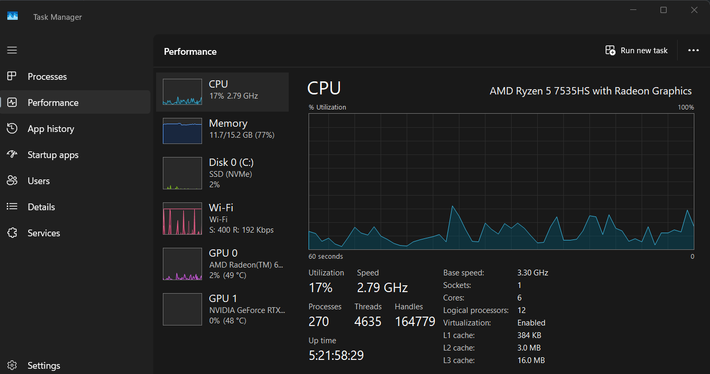
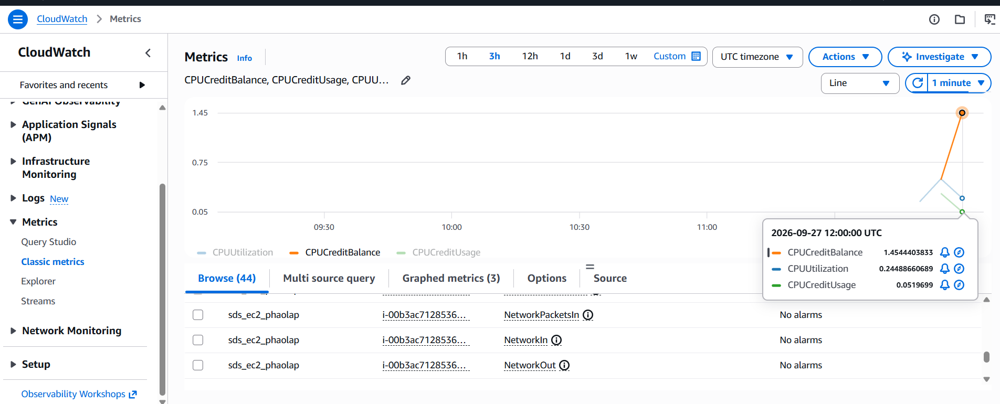
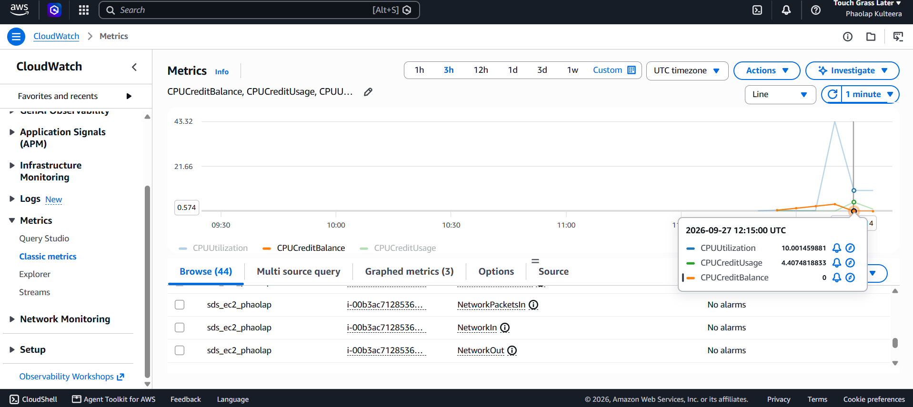
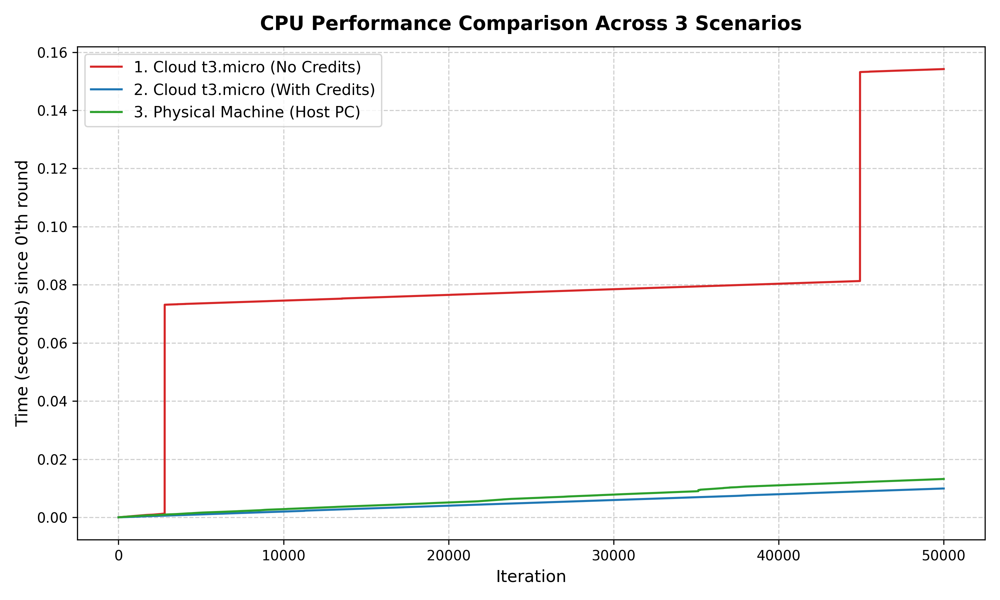
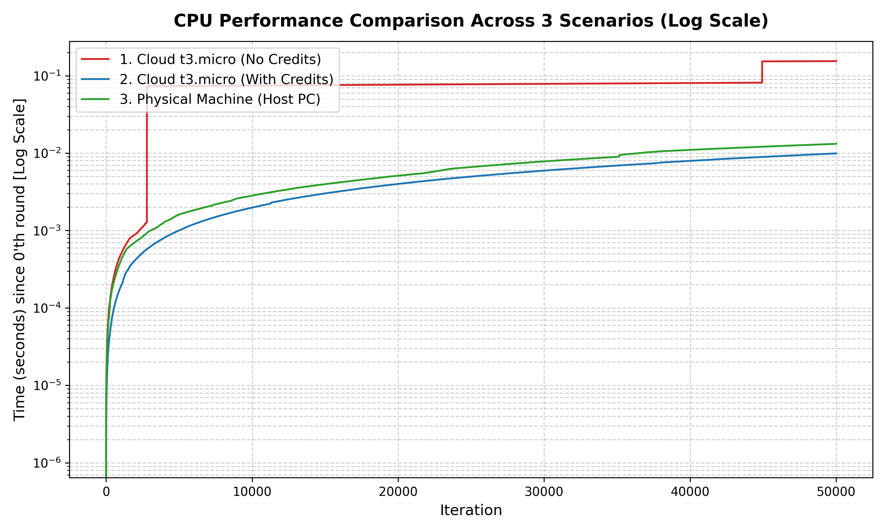

#### 1. Write cpu_test.py to measure CPU performance
Answer: 
```python
import time

l = [0 for _ in range(50001)]
for i in range(50001):
    l[i] = time.perf_counter_ns()
base = l[0]
for i in range(50001):
    l[i] = (l[i] - base)*(10**-9)
with open("result.txt", "w") as f:
    for idx, val in enumerate(l):
        f.write(f"{idx}, {val:.8f}")
        f.write("\n")
```

#### 2. Running cpu_test.py to collect CPU measurements
Answer: 
Host PC: 

EC2 with credit: 


EC2 without credit: 


#### 3. Comparison
Answer: 

| Scenario | 1. Cloud t3.micro Instance No Credits | 2. Cloud t3.micro Instance with Credits | 3. Your Physical Machine (Host PC) |
| :--- | :---: | :---: | :---: |
| **CPU Model and Speed (GHz)** | Intel Xeon 2.50 GHz | Intel Xeon 2.50 GHz | AMD Ryzen 5 7535HS 2.20 GHz |
| **Total time to run cpu_test.py (seconds)** | 0.15418858 | 0.00991503 | 0.01318360 |
| **Total time to run cpu_test.py (microseconds)** | 154,188.58 | 9,915.03 | 13,183.60 |


#### 4. Part 4: Answer these questions

##### 1. To understand how Clouds manage CPU resources

1.1. what is a CPU credit in AWS?
Answer: CPU Credit คือ Credit สำหรับการใช้งาน CPU บน Infrastrcture ของ Service EC2 ซึ่งใช้เพื่อกำหนด Performance ของ CPU ของ Infrastrcture Instance นั้นๆณ เวลานั้นๆ ถ้า Credit น้อย CPU ก็จะ utilize น้อยลง Credit เยอะก็จะรันได้เต็มประสิทธิภาพ

1.2. how does it benefit the Cloud user?
Answer:สำหรับผู้ใช้ Cloud ตามปกติไม่ได้ใช้ load CPU 100% ตลอดเวลาทำให้การมี Credit สามารถทำให้ User สะสม Credit ของตัวเอง ณ ตอนที่ตัวเ้องไม่ได้ใช้ CPU แล้วเอาใช้ Burst CPU เมื่อถึงเวลาที่ต้องใช้จริงๆได้ ทำให้ณ ตอนนั้น CPU จะทำงานเต็มประสิทธิภาพได้

1.3. how does it benefit the Cloud provider?
Answer: สามารถทำ Over commit ได้เพราะ User ไม่ได้ใช้ load cpu 100% ตลอดเวลาทำให้ถ้า Physical Hardware เขารองรับได้ 4 user เขาอาจจะให้ user มาใช้งานจริงๆ 8 คนก็ได้เพราะ ใช้งานไม่พร้อมกันอยู่แล้ว ณ ตอนไหนที่คนใช้น้อยก็ให้คนอื่นที่เกิน 4 คนมาใช้งานได้ ทำให้สามารถหาเงินได้มากขึ้น รวมถึงถ้าเกิดว่าใช้งานชนช่วงเวลากัน ใครที่ Credit หมดก็จะลด CPU Utilization เอาไปให้คนอื่นได้ทำงานเต็มประสิทธิภาพ แม้จะทำงานเกิน4 คนก็ตามเป็นต้น

##### 2. From the Cloud user's perspective, which has better (faster) CPU performance: Scenario 1 vs. Scenario 2? Why do you say so? Explain your answer using your plot.
Answer:


จากกราฟทั้งแบบ Linear Scale (comparison_plot.png) และ Log Scale (log_plot.png) จะเห็นได้อย่างชัดเจนว่า **Scenario 2 (Cloud with Credits) เร็วกว่าและมีประสิทธิภาพดีกว่า Scenario 1 (No Credits) อย่างมหาศาล** โดย Scenario 2 ใช้เวลาเพียง 0.00991503 วินาที ในขณะที่ Scenario 1 ใช้เวลาถึง 0.15418858 วินาที (ช้ากว่ากันถึงประมาณ 15.5 เท่า) 
สาเหตุเนื่องจาก Scenario 2 มี CPU Credit เหลืออยู่ ทำให้ vCPU สามารถ Burst ทำงานด้วยความเร็วสูงสุดของ Core ได้ตลอดการทดสอบ แต่ใน Scenario 1 นั้น Credit ถูกใช้งานจนหมด (CPUCreditBalance = 0) ทำให้ถูก AWS Hypervisor ควบคุมและลดความเร็ว (Throttled) ลงมาให้ทำงานไม่เกิน Baseline ทำให้ทุกๆ Iteration ที่วนลูปสะสมเวลาช้าลงอย่างต่อเนื่อง เส้นกราฟสีแดงของ Scenario 1 จึงพุ่งสูงขึ้นอย่างรวดเร็วมากเมื่อเทียบกับ Scenario 2

##### 3. Is your notebook faster than a t2.micro/t3.micro instance on the cloud? Explain your answer using your plot.
Answer: ขึ้นอยู่กับสถานะของ Credit บน Cloud โดยอ้างอิงจากเวลาและกราฟ (comparison_plot.png และ log_plot.png):
1. **เมื่อเทียบกับ Scenario 2 (t3.micro With Credits):** Notebook (0.01318360 วินาที) **ช้ากว่าเล็กน้อย** เนื่องจาก CPU บน Cloud สามารถ Burst ด้วยความถี่สูงสุดของ Intel Xeon (2.50 GHz) ได้เต็มที่
2. **เมื่อเทียบกับ Scenario 1 (t3.micro No Credits):** Notebook (0.01318360 วินาที) **เร็วกว่ามาก** (เร็วกว่าประมาณ 11.7 เท่า) เนื่องจาก Scenario 1 โดนจำกัดโควต้า CPU (Throttled) จากการที่ไม่มี Credit ทำให้ความเร็วตกลงมาอย่างมาก
- **สรุปลำดับความเร็ว:** t3.micro with credit (0.0099 วินาที) > Host PC (0.0132 วินาที) > t3.micro without credit (0.1542 วินาที)

##### 4. In all 3 scenarios, while cpu_test.py is running, is your CPU utilization up to 100%? Explain why/why not for each scenario.
Answer: ไม่ถึง 100% ในบาง scenario 
1. **Cloud no Credits:** ไม่ถึง 100% เพราะ Credit หมด (CPUCreditBalance = 0) ทำให้ AWS Hypervisor บีบ (Throttle) ไม่ให้ CPU ทำงานเกิน Baseline โดยจากภาพ CloudWatch (cpu_nocredit.png) ณ เวลา 12:15:00 UTC จะเห็นว่า CPU Utilization ถูกกดไว้ที่ 10.00% พอดีตามขีดจำกัด Baseline
2. **Cloud With Credits:** ในกราฟ CloudWatch (cpu_credit.png) ณ เวลา 12:00:00 UTC แสดง CPU Utilization เพียง 0.24% เนื่องจาก cpu_test.py ทำงานเร็วมาก (ใช้เวลาเพียง ~0.0099 วินาที) เมื่อ CloudWatch คำนวณค่าเฉลี่ยตามรอบเวลา (Metric interval 1 นาที) ค่าเฉลี่ยจึงแสดงออกมาน้อยมาก แต่ในทางทฤษฎีและทางปฏิบัติ ณ เสี้ยววินาทีที่รันนั้น vCPU ตัวที่ทำงานได้รันเต็ม 100% เพราะมี Credit พอสำหรับการ Burst
3. **Host PC (Notebook):** ถ้าดูจาก Task Manager รวมของระบบ จะเห็น CPU Usage แสดงเพียง 15-20% เนื่องจากคอมพิวเตอร์มีหลาย Core/Thread ค่าที่แสดงจึงเป็นการเฉลี่ยของทุก Core รวมกัน แต่หากเจาะดู Core ที่ใช้ประมวลผลกระบวนการของ Python (cpu_test.py) ในขณะนั้น จะทำงานเต็มประสิทธิภาพ 100% ของ Core นั้น
