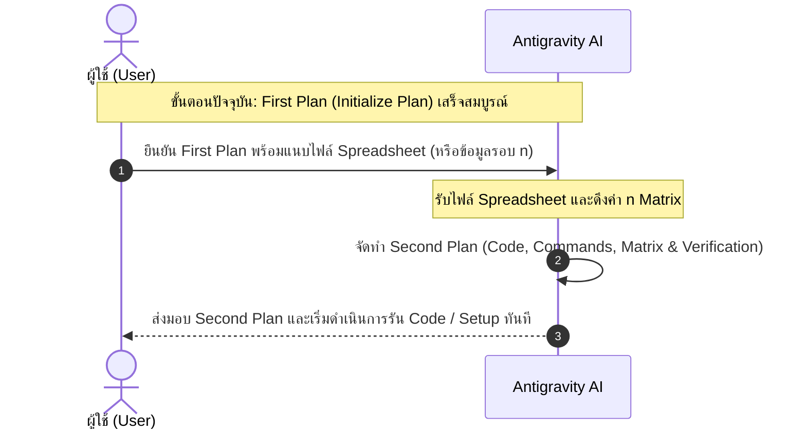

# First Plan (Initialize Plan): Activity 7 - Storage System Performance Benchmark

## 1. วัตถุประสงค์และภาพรวมของกิจกรรม (Activity Overview)
กิจกรรมนี้เป็นการทดสอบและวิเคราะห์เชิงเปรียบเทียบประสิทธิภาพของ Software-Defined Storage 3 ระบบบน AWS:
1. **AWS EBS (gp3)**: Network-attached POSIX Block Storage
2. **EC2 Ephemeral Storage (Instance Store)**: Direct-attached NVMe SSD POSIX Storage บนอินสแตนซ์ `c6gd.medium`
3. **Amazon S3**: Cloud Object Storage ที่เข้าถึงผ่าน HTTP/HTTPS REST API (จัดการผ่าน AWS SDK สำหรับ Python: `boto3`)

### ไฟล์ข้อมูลสำหรับการทดสอบ (Source Data Files)
มีเตรียมพร้อมอยู่ในไดเรกทอรีปัจจุบันเรียบร้อยแล้ว:
* `2KiB-1105622-17903235018753.txt` (ขนาด 2 KiB = 2,048 Bytes)
* `256KiB-1105622-17903235361980.txt` (ขนาด 256 KiB = 262,144 Bytes)
* `1MiB-1105622-17903235676279.txt` (ขนาด 1 MiB = 1,048,576 Bytes)
* `random_large.172259.1571618485.0595.txt` (ขนาด 128 MiB = 134,217,728 Bytes)

---

## 2. สถานะปัจจุบันและเงื่อนไขการก้าวสู่ Second Plan (Verification & Spreadsheet Gate)

> ### ⚠️ ข้อกำหนดสำคัญก่อนเริ่มจัดทำ Second Plan:
> 1. ในปัจจุบัน ลิงก์ Google Spreadsheet ที่ระบุในโจทย์ (`https://docs.google.com/spreadsheets/d/1Bft-iZAputGR9KRriEyOyxGZnK-W3OWjjnhLuEGin80/edit?usp=sharing`) ยังไม่สามารถเข้าถึงหรือดาวน์โหลดได้
> 2. **เมื่อผู้ใช้ตรวจสอบ First Plan นี้และต้องการยืนยันให้เริ่มสร้าง Second Plan:**
>    **ผู้ใช้จะต้องแนบไฟล์ Spreadsheet (หรือข้อมูลตารางการทดลอง เช่น จำนวนรอบ $n$ ที่กำหนดสำหรับแต่ละขนาดไฟล์และระบบ Storage) เข้ามาในระบบก่อน**
> 3. ข้อมูลรอบ $n$ จาก Spreadsheet จำเป็นอย่างยิ่งในการกำหนดพารามิเตอร์การทดลองจริง การเขียนสคริปต์ Automation และการสร้างตารางสรุปผลข้อมูลพร้อมกราฟให้ตรงตามเกณฑ์ของรายวิชา 100%

---

## 3. รายละเอียดขั้นตอนการดำเนินงาน: [Manual by User] vs [Code / Automated by AI/Scripts]

---

### Phase 1: การเตรียมสภาพแวดล้อม Local (Local Environment & Virtual Environment)

* **1.1 สร้างไฟล์ `requirements.txt` [Code / Automated by AI]**
  * สร้างไฟล์ `requirements.txt` ที่ระบุ dependencies จำเป็น:
    ```text
    boto3>=1.34.0
    botocore>=1.34.0
    matplotlib>=3.8.0
    pandas>=2.2.0
    openpyxl>=3.1.0
    ```
* **1.2 สร้างและติดตั้ง Python Virtual Environment (.venv) [Code / Automated via Terminal]**
  * รันคำสั่งสร้าง venv และติดตั้ง package:
    ```powershell
    python -m venv .venv
    .\.venv\Scripts\python.exe -m pip install --upgrade pip
    .\.venv\Scripts\pip install -r requirements.txt
    ```
* **1.3 ตรวจสอบความพร้อมของระบบ [Manual by User]**
  * ตรวจสอบว่าเครื่อง Local มี Python (แนะนำเวอร์ชัน 3.10 ขึ้นไป)
  * ทดสอบ Activate Virtual Environment ใน PowerShell หรือ VS Code Terminal:
    ```powershell
    .\.venv\Scripts\Activate.ps1
    ```

---

### Phase 2: การกำหนดค่า AWS IAM & Local Credentials ที่ `C:\Users\USER\.aws\credentials`

* **2.1 สร้าง IAM Policy JSON แบบ Least-Privilege [Code / Automated by AI]**
  * สร้างไฟล์ `iam_s3_least_privilege_policy.json` เพื่อกำหนดสิทธิ์เฉพาะ S3 Actions ที่จำเป็นตามหลัก Least Privilege (เพื่อตอบคำถามข้อ 6):
    ```json
    {
      "Version": "2012-10-17",
      "Statement": [
        {
          "Sid": "VisualEditor0",
          "Effect": "Allow",
          "Action": [
            "s3:PutObject",
            "s3:GetObject",
            "s3:DeleteObject",
            "s3:ListBucket"
          ],
          "Resource": [
            "arn:aws:s3:::act7-storage-benchmark-*",
            "arn:aws:s3:::act7-storage-benchmark-*/*"
          ]
        }
      ]
    }
    ```
* **2.2 สร้าง IAM User และ Access Key บน AWS Console [Manual by User]**
  * เข้าสู่ AWS Management Console -> บริการ **IAM**
  * ไปที่ **Users** -> คลิก **Create user** (ตั้งชื่อ เช่น `act7-benchmark-user`)
  * กำหนด Permissions: เลือก **Attach policies directly** -> **Create policy** แล้ววาง JSON จากข้อ 2.1
  * เมื่อสร้าง User เสร็จ ให้เข้าไปที่แท็บ **Security credentials** -> **Create access key** (เลือก Use case เป็น *Command Line Interface (CLI)* หรือ *Local code*)
  * บันทึกค่า **Access Key ID** และ **Secret Access Key**
* **2.3 เตรียมโฟลเดอร์และไฟล์ Local AWS Credentials [Code / Automated via Script]**
  * ตรวจสอบและสร้างโฟลเดอร์ `C:\Users\USER\.aws\` หากยังไม่มี
  * เตรียมไฟล์แม่แบบ `C:\Users\USER\.aws\credentials` และ `C:\Users\USER\.aws\config`
* **2.4 บันทึก Credentials ลงในเครื่อง Local [Manual by User]**
  * นำ Key ที่ได้จาก AWS Console มาใส่ใน `C:\Users\USER\.aws\credentials`:
    ```ini
    [default]
    aws_access_key_id = <YOUR_ACCESS_KEY_ID>
    aws_secret_access_key = <YOUR_SECRET_ACCESS_KEY>
    ```
  * และกำหนด Region ใน `C:\Users\USER\.aws\config`:
    ```ini
    [default]
    region = ap-southeast-1
    output = json
    ```
* **2.5 ทดสอบการเข้าถึง AWS จาก Local Machine [Code / Automated via Script]**
  * รันสคริปต์สั้น `verify_aws_creds.py` ผ่าน `boto3` เพื่อตรวจสอบว่าระบบ Local สามารถอ่าน credentials จาก `C:\Users\USER\.aws\credentials` และเรียกใช้ AWS STS/S3 ได้อย่างถูกต้อง

---

### Phase 3: การตั้งค่า AWS EC2 Instance และ Storage Mount (สำหรับการทดลอง Benchmark จริง)

> **หมายเหตุสำคัญ**: การวัด Throughput ของ Ephemeral Storage (Instance Store NVMe) และ EBS จะต้องรันบนเครื่อง EC2 จริงตามคู่มือ `Act_2_setup_guide` เนื่องจาก Local Machine ไม่มีฮาร์ดแวร์ Direct-attached NVMe ของ AWS

* **3.1 Launch EC2 Instance [Manual by User]**
  * บน AWS EC2 Console สร้าง Instance ตามสเปก:
    * **AMI**: Ubuntu Server 24.04 LTS (64-bit Arm)
    * **Instance Type**: `c6gd.medium` (*ห้ามเลือก c6g.medium เพราะไม่มี Ephemeral NVMe*)
    * **Storage**:
      1. EBS Volume (`/dev/sda1` หรือ root volume gp3 ขนาดเริ่มต้นหรือ 60 GB)
      2. Ephemeral Storage (Volume 2 บน `/dev/nvme1n1` ขนาดประมาณ 59 GB)
    * **Key pair**: สร้างหรือเลือก Key pair (`.pem`) เพื่อใช้ SSH
* **3.2 สร้าง S3 Bucket สำหรับทดสอบ [Manual by User หรือ Script]**
  * สร้าง S3 Bucket ใน Region เดียวกับ EC2 (เช่น `ap-southeast-1`) เพื่อความแม่นยำในการวัดผลและลด latency ข้าม Region
* **3.3 SSH และ Mount Ephemeral Storage บน EC2 [Manual by User]**
  * SSH เข้าเครื่อง EC2: `ssh -i <your-key.pem> ubuntu@<ec2-public-ip>`
  * Format และ Mount ไดรฟ์ Ephemeral ตามสไลด์ `Act_2_setup_guide`:
    ```bash
    sudo mkfs.ext4 /dev/nvme1n1
    sudo mkdir -p /mnt/eph
    sudo mount -t ext4 /dev/nvme1n1 /mnt/eph/
    sudo chown -R ubuntu /mnt/eph/
    ```
  * สร้างโฟลเดอร์สำหรับทดสอบ EBS: `mkdir -p ~/ebs_test`
* **3.4 เตรียมสภาพแวดล้อมบน EC2 [Manual by User]**
  * รันคำสั่งติดตั้ง Python และ Boto3:
    ```bash
    sudo apt update && sudo apt install -y python3-pip python3-venv
    ```
  * นำโค้ด `test_fs.py`, `test_s3.py` และไฟล์ทดสอบ 4 ไฟล์ขึ้นไปไว้บน EC2 (ผ่าน `scp` หรือ git)

---

### Phase 4: การพัฒนา Benchmark Programs (`test_fs.py` & `test_s3.py`)

* **4.1 พัฒนาโปรแกรม `test_fs.py` [Code / Automated by AI]**
  * **Input Arguments**:
    1. `source_data`: path ไฟล์สุ่มต้นทาง
    2. `target_dir`: path ไดเรกทอรีปลายทาง (เช่น `~/ebs_test/` หรือ `/mnt/eph/`)
    3. `n`: จำนวนรอบในการสร้างไฟล์ใหม่
  * **Algorithm**:
    1. อ่านข้อมูลไฟล์ต้นทางครั้งเดียวเก็บลง Memory เป็นตัวแปร `r`
    2. บันทึกเวลาเริ่ม: `t0 = time.time()`
    3. วนลูป $n$ รอบ: ในแต่ละรอบเปิดไฟล์ใหม่ (`open(..., 'wb')`), เขียนข้อมูล `r` (`f.write(r)`), และปิดไฟล์ (`f.close()`)
       * *ข้อกำหนดโจทย์*: ต้องสร้างไฟล์ใหม่เสมอ ห้ามเขียนทับไฟล์เดิม
    4. บันทึกเวลาสิ้นสุด: `t1 = time.time()`
    5. **ห้ามพิมพ์ข้อความใดๆ ระหว่างลูป** ให้แสดงผล Elapsed time (วินาที) และคำนวณ Throughput (MB/s) เมื่อจบทุกลูปแล้วเท่านั้น
* **4.2 พัฒนาโปรแกรม `test_s3.py` [Code / Automated by AI]**
  * **Input Arguments**:
    1. `source_data`: path ไฟล์สุ่มต้นทาง
    2. `n`: จำนวนรอบในการเขียน Object ใหม่
    3. `bucket_name`: ชื่อ S3 Bucket
  * **Algorithm**:
    1. อ่านข้อมูลไฟล์ต้นทางครั้งเดียวลง Memory (`r`)
    2. เชื่อมต่อ `boto3.client('s3')`
    3. บันทึกเวลาเริ่ม: `t0 = time.time()`
    4. วนลูป $n$ รอบ: เรียก `s3_client.put_object(Bucket=bucket, Key=f"benchmark_obj_{i}.dat", Body=r)`
    5. บันทึกเวลาสิ้นสุด: `t1 = time.time()`
    6. แสดงผล Elapsed time และ Throughput เมื่อจบการทำงาน
* **4.3 สร้างสคริปต์ Runner สำหรับรันการทดลองอัตโนมัติ [Code / Automated by AI]**
  * พัฒนาสคริปต์ `run_all_benchmarks.py` สำหรับรันการทดลองให้ครบทุกเงื่อนไข:
    * วนลูปทดสอบครบทั้ง 4 ขนาดไฟล์ บน Storage ทั้ง 3 ระบบ
    * ทำซ้ำอย่างน้อย 3 รอบต่อ Scenario แล้วหาค่าเฉลี่ย
    * มีกลไก **Cleanup ไฟล์เก่าก่อนเริ่มรันรอบถัดไป** (`find ... -delete` และ S3 Batch Delete) ตามคำแนะนำในโจทย์ เพื่อป้องกันผลกระทบต่อ Performance

---

### Phase 5: การวิเคราะห์ข้อมูล สร้างกราฟ และตอบคำถามท้ายกิจกรรม

* **5.1 สคริปต์ประมวลผลข้อมูลและสร้างกราฟ [Code / Automated by AI]**
  * นำผลเวลาเฉลี่ยมาคำนวณ Throughput (MB/s) และบันทึกลง Spreadsheet
  * พลอตกราฟด้วย `matplotlib`:
    * **Graph 1**: Total Bytes Written vs Throughput (Normalized ตามขนาดไฟล์และ Storage)
    * **Graph 2**: Number of Files (Iterations) vs Performance (ตรวจสอบ Linearity)
* **5.2 การจัดทำบทวิเคราะห์และตอบคำถาม 7 ข้อ [Code / Automated Drafting]**
  * **Q1 (File Size vs Throughput)**: วิเคราะห์ว่าทำไม Throughput จึงแปรผันตามขนาดไฟล์ (Fixed Metadata Overhead, TCP packetization, Block-level Transfer size)
  * **Q2 (Iterations vs Performance)**: วิเคราะห์การ Scale เชิงเส้นเมื่อจำนวนไฟล์เพิ่มขึ้น และปัจจัยคอขวดของแต่ละ Storage
  * **Q3 (EBS vs Ephemeral Storage)**: เปรียบเทียบความเร็ว และเจาะลึกความแตกต่างเชิงสถาปัตยกรรม (NVMe PCIe Direct Bus vs Network NVMe over TCP/Fabric, Virtualization Layer, I/O Caching)
  * **Q4 (EBS vs S3)**: เปรียบเทียบ Block Storage vs Object Storage (HTTP/REST Overheads, TLS Handshake, Multi-AZ Replication)
  * **Q5 (S3 Partial Updates)**: อธิบายเรื่อง Immutability ของ S3 ว่าทำไมอัปเดตข้อมูลบางส่วนไม่ได้ และเหตุผลเชิงสถาปัตยกรรมของ AWS (High Availability, Simple Consistency Model, Distributed Storage)
  * **Q6 (S3 Permissions & Policy JSON)**: นำเสนอ Policy JSON แบบ Least-Privilege พร้อมอธิบายว่าทำไมไม่ควรใช้ `AmazonS3FullAccess`
  * **Q7 (S3 Optimization)**: วิเคราะห์คอขวดของ S3 (Network Round-Trip Time) และเสนอแนวทาง Optimization (เช่น การใช้ Multi-threading / Async I/O ด้วย `ThreadPoolExecutor` หรือ Transfer Manager)

---

## 4. แผนปฏิบัติการขั้นตอนถัดไป (Next Step Action Plan)



1. ผู้ใช้ตรวจสอบความสมบูรณ์ของ **First Plan** ในเอกสารฉบับนี้
2. **เมื่อผู้ใช้พร้อมและยืนยัน First Plan: กรุณาแนบไฟล์ Spreadsheet (หรือข้อมูลตารางการทดลอง) เข้ามาในแชท**
3. ทางเราจะเริ่มจัดทำ **Second Plan** และลงมือสร้างไฟล์โปรแกรมและรันคำสั่ง Setup สภาพแวดล้อมตามลำดับทันที
