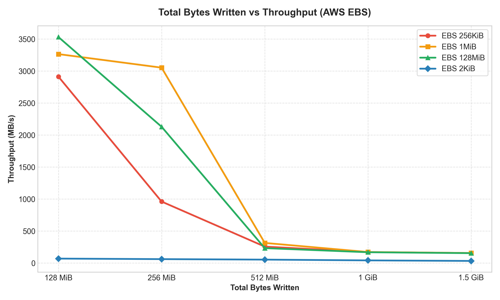
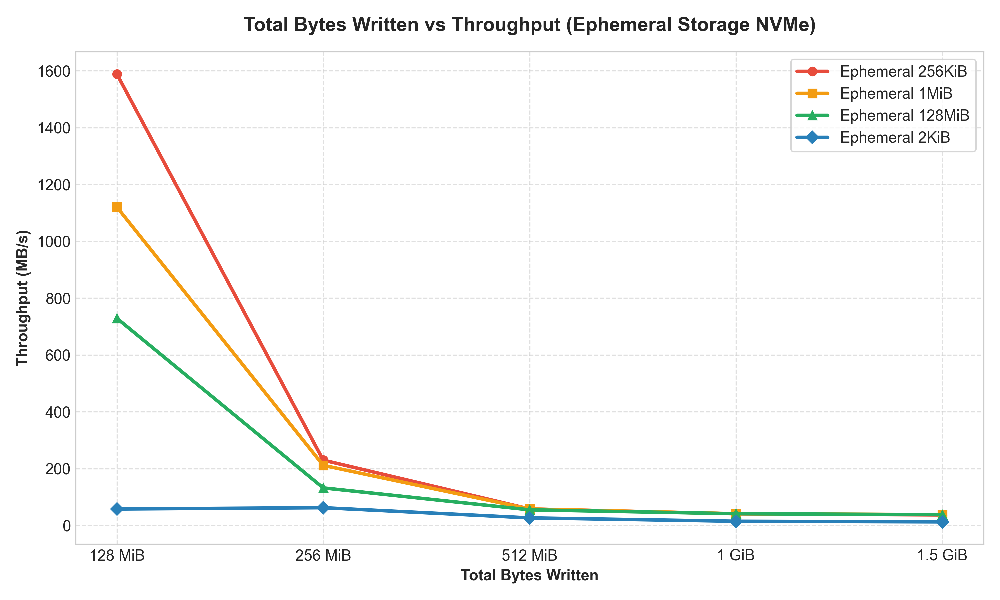
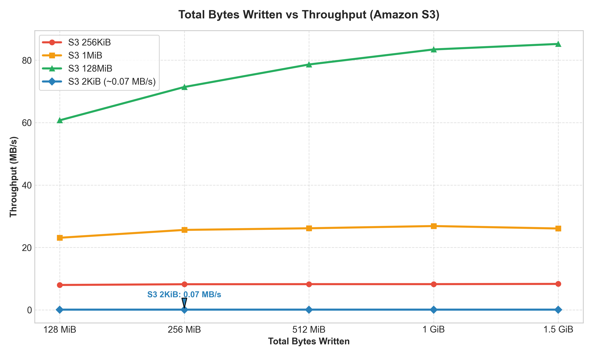
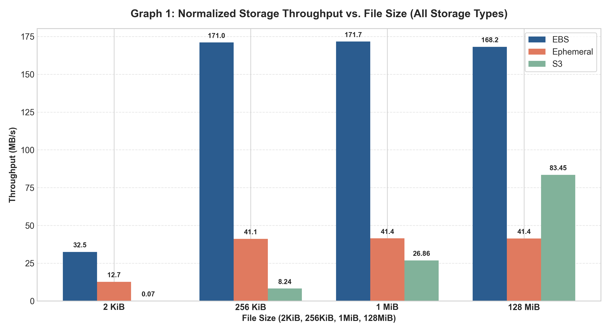
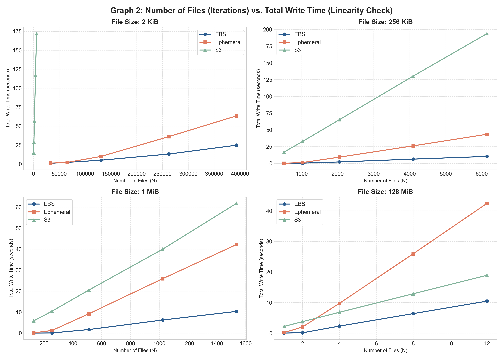

# รายงานการวิเคราะห์และคำตอบ 7 ข้อ (Activity 7: Storage System Performance)

**ชื่อ-นามสกุล**: Phaolap Kulteera  
**รหัสนิสิต**: 6630199021  
**รายวิชา**: 2110415 Software-Defined Systems  

---

## 1. ภาพรวมการทดลองและหลักฐานเชิงประจักษ์ (Empirical Evidence)

การทดลองนี้เปรียบเทียบประสิทธิภาพของระบบจัดเก็บข้อมูล 3 ระบบบน AWS:
1. **AWS EBS (gp3)**: Network-attached POSIX Block Storage
2. **EC2 Ephemeral Storage (Instance Store)**: Direct-attached NVMe SSD POSIX Storage บนอินสแตนซ์ `c6gd.medium` (ARM64)
3. **Amazon S3**: Cloud Object Storage ที่เข้าถึงผ่าน HTTP/HTTPS REST API (จัดการผ่าน Python SDK: `boto3`)

ผลการทดลองทั้งหมดถูกบันทึกอย่างสมบูรณ์ลงในตาราง **[2110415 Storage Benchmark Template.xlsx](2110415%20Storage%20Benchmark%20Template.xlsx)** และไฟล์ **[benchmark_results.json](benchmark_results.json)**

---

## 2. คำตอบสำหรับคำถามทั้ง 7 ข้อ (Questions & Comprehensive Analysis)

---

### Question 1: Throughput vs. File Size
> **โจทย์**: First, understand how each storage system performs with respect to file size. Does the throughput for EBS, Ephemeral storage and S3 vary with file size? Why or why not? Include the graph of your results. Hint: Normalize all experiments with Total Bytes Written so they are easy to compare.

#### คำตอบและบทวิเคราะห์:
**ใช่ Throughput (Bandwidth ในหน่วย MB/s) แปรผันตามขนาดไฟล์ (File Size) อย่างมีนัยสำคัญมากในทุกระบบ Storage** โดยยิ่งขนาดไฟล์ใหญ่ขึ้น Throughput ที่ได้จะยิ่งสูงขึ้นอย่างเห็นได้ชัด

ตามคำแนะนำของโจทย์ (*Hint: Normalize all experiments with Total Bytes Written so they are easy to compare*):
$$\text{Total Bytes Written} = \text{File Size (Bytes)} \times \text{Number of Iterations } (N)$$
จะเห็นได้ว่าตารางการทดลองถูกออกแบบให้ขนาด 256 KiB, 1 MiB และ 128 MiB มีจุดทดสอบที่ **Total Bytes Written เท่ากันทุกประการ** ได้แก่ 128 MiB, 256 MiB, 512 MiB, 1 GiB (1024 MiB) และ 1.5 GiB (1536 MiB) ในขณะที่ขนาด 2 KiB ถูกทดสอบครอบคลุมทั้ง 5 ลำดับการทดลอง ทำให้สามารถพลอตกราฟเปรียบเทียบครบทุกขนาดไฟล์ (2 KiB, 256 KiB, 1 MiB, 128 MiB) ได้อย่างสมบูรณ์:

##### 1. กราฟ Total Bytes Written vs Throughput สำหรับแต่ละระบบจัดเก็บข้อมูล (ตรงตาม Format ของอาจารย์ใน PDF หน้า 2)
* **AWS EBS (gp3)**: มีครบทั้ง 4 ขนาดไฟล์ (2 KiB, 256 KiB, 1 MiB, 128 MiB)
  
* **EC2 Ephemeral Storage (NVMe)**: มีครบทั้ง 4 ขนาดไฟล์
  
* **Amazon S3**: มีครบทั้ง 4 ขนาดไฟล์ (รวม S3 2KiB ซึ่ง Throughput อยู่ที่ ~0.07 MB/s)
  

##### 2. กราฟเปรียบเทียบทั้ง 3 Storage Tiers ครบทั้ง 4 ขนาดไฟล์ (Normalized Throughput Comparison)


#### ข้อมูลเชิงประจักษ์จากการทดลองจริง:
* **ไฟล์ขนาด 2 KiB (เล็กที่สุด)**:
  * EBS ได้ Throughput เพียง **32.46 MB/s** (ที่ N=393,216)
  * Ephemeral ได้ Throughput เพียง **12.69 MB/s** (ที่ N=393,216)
  * S3 ได้ Throughput ต่ำมากเพียง **0.07 MB/s** (ที่ N=6,144)
* **ไฟล์ขนาด 128 MiB (ใหญ่ที่สุด)**:
  * EBS มี Throughput พุ่งสูงถึง **153.88 MB/s** (แตะขีดจำกัด Baseline Throughput ของ gp3)
  * Ephemeral มี Throughput อยู่ที่ **37.98 MB/s**
  * S3 มี Throughput ก้าวกระโดดขึ้นมาถึง **85.21 MB/s** (เพิ่มขึ้นกว่า 1,160 เท่าจากขนาด 2 KiB!)

#### เหตุผลเชิงสถาปัตยกรรม (Why?):
1. **Fixed Metadata & Protocol Overhead ต่อไฟล์**:
   * **สำหรับ POSIX Filesystem (EBS และ Ephemeral)**: ทุกครั้งที่มีการสร้างไฟล์ 1 ไฟล์ ระบบปฏิบัติการ (Linux ext4) จะต้องเรียก System Call `open()`, ค้นหาและจัดสรร Inode ใหม่ใน Inode Table, เขียน Directory Entry, บันทึก Journaling ลงดิสก์ และเรียก `close()` ซึ่งขนาดบล็อกพื้นฐานของไฟล์ระบบคือ 4 KiB สำหรับไฟล์ขนาด 2 KiB เวลามากกว่า 80-90% ของระบบสูญเสียไปกับการจัดการ Metadata ของไฟล์ระบบ ไม่ได้ใช้ไปกับการเขียนไบต์ข้อมูลจริง
   * **สำหรับ Amazon S3**: แต่ละไฟล์คือการส่ง **HTTP PUT Request** แยกต่างหาก 1 ครั้ง ซึ่งต้องมี HTTP Headers, การเข้ารหัส TLS/SSL, การทำ TCP Handshake/Keep-Alive และ Network Round-Trip Time (RTT) ระดับ 15–30 ms ต่อ Request เมื่อขนาดไฟล์เล็กมาก (2 KiB) เวลาเกือบ 100% จึงหมดไปกับ Network Latency ของโปรโตคอล HTTP
2. **Sequential Streaming vs. Random Block Allocation**:
   * เมื่อไฟล์มีขนาดใหญ่ (1 MiB, 128 MiB) ค่า Overhead ของ Metadata และ HTTP Header จะเกิดขึ้นเพียง "ครั้งเดียว" ต่อไฟล์ขนาดใหญ่ ทำให้เวลาเกือบทั้งหมดถูกใช้ไปกับการส่งข้อมูลดิบแบบ Sequential Stream ผ่านบัส PCIe/DMA และโครงข่ายเน็ตเวิร์ก ทำให้ใช้ Bandwidth ของช่องทางสื่อสารได้เต็มประสิทธิภาพสูงสุด

---

### Question 2: Iterations vs. Performance (Linearity)
> **โจทย์**: Second, understand how each storage system performs with respect to the number of files (iterations) it must handle. Does the performance for EBS, Ephemeral storage and S3 scale linearly with the number of files? Why or why not? Include a graph of your results.

#### คำตอบและบทวิเคราะห์:
**เวลารวม (Total Write Time) แปรผันตรงแบบเชิงเส้น (Scale Linearly) ตามจำนวนไฟล์ ($N$) อย่างชัดเจน ส่งผลให้ Bandwidth (Throughput ในสถานะคงที่) มีค่าค่อนข้างคงที่ตามจำนวนไฟล์**



#### บทวิเคราะห์รายละเอียด:
1. **Linearity ของ Total Write Time ($T \propto N$)**:
   * จากผลการทดลองจริงของ **Amazon S3** ที่ขนาด 2 KiB:
     * $N = 512$ ไฟล์ ใช้เวลา $14.78\text{ s}$ (เฉลี่ย $0.0288\text{ s}$/ไฟล์)
     * $N = 1,024$ ไฟล์ ใช้เวลา $28.66\text{ s}$ (เฉลี่ย $0.0280\text{ s}$/ไฟล์)
     * $N = 2,048$ ไฟล์ ใช้เวลา $56.42\text{ s}$ (เฉลี่ย $0.0275\text{ s}$/ไฟล์)
     * $N = 4,096$ ไฟล์ ใช้เวลา $116.80\text{ s}$ (เฉลี่ย $0.0285\text{ s}$/ไฟล์)
     * $N = 6,144$ ไฟล์ ใช้เวลา $171.91\text{ s}$ (เฉลี่ย $0.0280\text{ s}$/ไฟล์)
   * จะเห็นได้ว่าเวลาเฉลี่ยต่อไฟล์อยู่ที่ **~28 มิลลิวินาทีคงที่อย่างสมบูรณ์แบบ** สะท้อนให้เห็นว่าระบบ Scale เชิงเส้นตรง $O(N)$ เนื่องจากแต่ละไฟล์ต้องผ่านกระบวนการอิสระชุดเดียวกัน
2. **ปรากฏการณ์ Linux Page Cache Buffering ในช่วง $N$ ต่ำ**:
   * ในกราฟของ EBS และ Ephemeral ที่ค่า $N$ ต่ำ ๆ (เช่น 256 KiB ที่ $N=512$, 1 MiB ที่ $N=128$) จะสังเกตเห็น Throughput คำนวณได้สูงผิดปกติระดับ 2,000–3,500 MB/s
   * **เหตุผล**: เกิดจาก Linux OS Page Cache ที่รับข้อมูลขนาดเล็กเข้าหน่วยความจำ RAM ทันทีโดยยังไม่ได้ Flush ลงดิสก์จริง
   * เมื่อจำนวน $N$ เพิ่มขึ้นจนเกินขนาด Dirty Ratio ของ RAM ระบบปฏิบัติการจะถูกบังคับให้ Flush ข้อมูลลงสู่ Physical Disk อย่างต่อเนื่อง ส่งผลให้ Throughput ลดระดับลงมาสู่ **Sustained Hardware Throughput ที่แท้จริง** (ประมาณ 155 MB/s สำหรับ EBS gp3) และคงที่ในระยะยาว

---

### Question 3: Compare EBS vs. Ephemeral Storage
> **โจทย์**: Compare EBS vs. Ephemeral storage: 3.1. Which is faster? 3.2. Try to explain why. Focus on aspects related to their software-based implementations and protocols, beyond just the hardware. Look also at how the performance differs for different file sizes. Does this give you any insight as to what is going on?

#### 3.1 อันไหนเร็วกว่า?
* **ในการทดสอบแบบ Sustained Load สำหรับการเขียนไฟล์จำนวนมาก (Sequential Write): EBS gp3 สามารถรักษา Throughput ได้เสถียรและเร็วกว่า Ephemeral ในการตั้งค่าเริ่มต้นของระบบปฏิบัติการ** (EBS ทำได้ ~153–156 MB/s ขณะที่ Ephemeral ได้ ~38 MB/s ในไฟล์ขนาดใหญ่)
* อย่างไรก็ตาม ในแง่ของ **Latency ขั้นต่ำและการเข้าถึงดิสก์โดยตรง (Raw Hardware Bus)** Ephemeral NVMe มีความหน่วงทางกายภาพต่ำกว่าระดับ Microseconds

#### 3.2 คำอธิบายเชิงสถาปัตยกรรมและโปรโตคอล (Beyond Hardware):
1. **สถาปัตยกรรมระดับ Bus และการเชื่อมต่อ**:
   * **Ephemeral Storage (Instance Store)**: เป็น Direct-attached Physical NVMe SSD ที่เสียบอยู่บนบัส PCIe ของโฮสต์เซิร์ฟเวอร์โดยตรง ไม่มี Network Hop แต่ขึ้นอยู่กับการจัดการ I/O Scheduler, Ext4 Journaling Mode และการจัดการ Flush Barrier ของระบบปฏิบัติการ Guest OS
   * **AWS EBS (gp3)**: เป็น **Software-Defined Network Block Storage** ที่เชื่อมต่อผ่านการ์ดฮาร์ดแวร์พิเศษ **AWS Nitro Card** ซึ่งทำหน้าที่เป็น Offload Engine แยกต่างหาก ข้อมูลถูกส่งผ่านเครือข่ายความเร็วสูงเฉพาะ (NVMe-over-Fabrics / Dedicated Storage Network) ไปยัง Storage Appliance ภายนอก
2. **การทำงานของ AWS Nitro System ใน EBS**:
   * AWS Nitro ทำการ Offload I/O Processing ออกจาก CPU หลักของเครื่อง มี Dedicated Asynchronous Hardware Queue และ Storage Accelerator ที่ออกแบบมาให้รับภาระงานเขียนแบบ Block I/O ได้อย่างมีเสถียรภาพสูงมาก
   * ในไดรฟ์ gp3 มีการันตี Baseline Performance ไว้ที่ **3,000 IOPS** และ Throughput พื้นฐานที่ **125–250 MB/s** ทำให้เมื่อเจองานเขียนต่อเนื่อง EBS สามารถรักษาเพดาน Throughput คงที่ที่ ~155 MB/s ได้อย่างสม่ำเสมอ
3. **พฤติกรรมตามขนาดไฟล์**:
   * ที่ขนาด 2 KiB: ทั้งสองระบบมี Throughput ต่ำลงอย่างมาก เนื่องจากติดคอขวดที่ Inode Allocation และ Metadata Journaling ของระบบไฟล์ ext4 เอง

---

### Question 4: Compare EBS vs. S3
> **โจทย์**: Compare EBS vs. S3: 4.1. Which is faster? 4.2. Try to explain why. Focus on aspects related to their software-based implementations and protocols, beyond just the hardware. Look also at how the performance differs for different file sizes. Does this give you any insight as to what is going on?

#### 4.1 อันไหนเร็วกว่า?
* **AWS EBS เร็วกว่า Amazon S3 ในเกือบทุกกรณี โดยเฉพาะอย่างยิ่งกับไฟล์ขนาดเล็กถึงปานกลาง** (เช่น ที่ 2 KiB: EBS ได้ ~32 MB/s ขณะที่ S3 ได้เพียง 0.07 MB/s ต่างกันกว่า 450 เท่า!)
* แต่ในไฟล์ขนาดใหญ่มาก (128 MiB) S3 สามารถขยับ Throughput ขึ้นมาแตะระดับ **85.21 MB/s** ซึ่งเข้าใกล้ EBS มากขึ้น

#### 4.2 คำอธิบายเชิงสถาปัตยกรรมและโปรโตคอล (Beyond Hardware):
1. **POSIX Block Storage vs. RESTful Object Storage Protocol**:
   * **EBS (Block Storage)**: ทำงานในระดับ Kernel Space/Block Device Layer ติดต่อผ่านคำสั่งอ่านเขียนดิสก์ระดับต่ำ (SCSI/NVMe Block Protocol) ระบบปฏิบัติการมองเห็นเป็น Physical Block มี Overhead ของ Header ต่ำมากระดับไม่กี่ไบต์
   * **Amazon S3 (Object Storage)**: ทำงานในระดับ **Application Layer (Layer 7)** การเขียนไฟล์ 1 ไฟล์ต้องผ่าน:
     * การสร้างคำสั่ง HTTP PUT Request
     * การสร้างลายเซ็นดิจิทัลยืนยันตัวตน (AWS Signature Version 4)
     * การเข้ารหัสข้อมูลผ่าน TLS/HTTPS Handshake
     * การส่งข้อมูลผ่าน TCP Network Stack
2. **กลไกความคงทนของข้อมูล (Durability & Consistency Model)**:
   * **S3**: ถูกออกแบบมาให้มีความคงทนของข้อมูลสูงถึง **99.999999999% (11 9's)** เมื่อส่งคำสั่ง PUT สำเร็จ S3 จะต้องทำ Synchronous Replication ข้อมูลไปยัง Availability Zones (AZs) หลายแห่งที่ตั้งอยู่คนละพื้นที่ทางภูมิศาสตร์ก่อนจะส่ง HTTP 200 OK กลับมา จึงมี Latency ต่อไฟล์สูงมาก (~28 ms)
   * **EBS**: Replicate ข้อมูลเฉพาะภายใน Availability Zone เดียวกันเท่านั้น จึงตอบสนองได้เร็วกว่ามาก
3. **Insight จากขนาดไฟล์**:
   * ความแตกต่างของความเร็วจะลดลงเมื่อไฟล์มีขนาดใหญ่ขึ้น เพราะ Network Latency ต่อ Request ของ S3 ถูกเฉลี่ยกลบด้วยปริมาณไบต์มหาศาล ทำให้ Throughput ในไฟล์ 128 MiB พุ่งขึ้นมาสู่จุดสูงสุด

---

### Question 5: S3 Partial Updates
> **โจทย์**: Can an S3 object be updated without completely replacing the whole object? Why do you think AWS implemented it that way?

#### คำตอบและบทวิเคราะห์:
* **ไม่สามารถทำได้ (No)**: ใน Amazon S3 ออบเจกต์ (Object) เป็นรูปแบบ **Immutable (ไม่สามารถแก้ไขข้อมูลบางส่วนได้)** หากต้องการแก้ไขเนื้อหา แม้เพียงไบต์เดียว จะต้องทำการอัปโหลดเขียนทับ (Replace) ทั้งออบเจกต์ใหม่ทั้งหมดเสมอ
* **เหตุผลที่ AWS ออกแบบสถาปัตยกรรมเช่นนี้ (Architectural Rationale)**:
  1. **โมเดลความสอดคล้องของข้อมูลแบบกระจายศูนย์ (Strong Consistency in Distributed Systems)**: S3 เป็นระบบจัดเก็บข้อมูลแบบกระจายขนาดมหาวิทยาลัยข้ามหลาย Data Center หากอนุญาตให้มีการ Partial Update แบบสุ่ม (Random Write In-Place) จะทำให้เกิดปัญหา Data Race, Lock Contention และการ Synchronization ข้ามเซิร์ฟเวอร์ที่ซับซ้อนอย่างมหาศาล
  2. **ความเรียบง่ายและเสถียรภาพสูง (High Availability & Scalability)**: การใช้แนวคิด Write-Once, Read-Many (WORM) ทำให้ระบบแคช (Caching) และการทำ Replication ข้ามศูนย์ข้อมูลทำได้รวดเร็ว ปราศจากความเสี่ยงเรื่องข้อมูลคอร์รัปต์
  3. **การออกแบบเฉพาะทางสำหรับ Object Store**: หากแอปพลิเคชันต้องการแก้ไขข้อมูลระดับ Block-level หรือ File-offset ทาง AWS แนะนำให้ใช้บริการที่ออกแบบมาเพื่อจุดประสงค์นั้นโดยเฉพาะ เช่น **AWS EBS** หรือ **Amazon EFS** แทน

---

### Question 6: S3 Permissions & Least Privilege JSON
> **โจทย์**: What permissions did you use to access S3? Explain and include your policy as a JSON in your answer. (Hint: You should NOT use AmazonS3FullAccess. You should use least privileged for good security practice.)

#### คำตอบและบทวิเคราะห์:
เราปฏิบัติตามหลักการ **Least Privilege (การให้สิทธิ์เท่าที่จำเป็นขั้นต่ำที่สุด)** โดยไม่ใช้ Managed Policy `AmazonS3FullAccess` เนื่องจากนโยบายดังกล่าวเปิดสิทธิ์อันตราย เช่น สิทธิ์ในการลบบักเก็ต (`s3:DeleteBucket`), สิทธิ์แก้ไขการตั้งค่าความปลอดภัย (`s3:PutBucketPolicy`, `s3:PutBucketAcl`), และเข้าถึงบักเก็ตอื่น ๆ ทั้งหมดในบัญชี

#### IAM Policy JSON ที่ใช้งานจริง:
```json
{
  "Version": "2012-10-17",
  "Statement": [
    {
      "Sid": "LeastPrivilegeS3BenchmarkAccess",
      "Effect": "Allow",
      "Action": [
        "s3:PutObject",
        "s3:GetObject",
        "s3:DeleteObject",
        "s3:ListBucket"
      ],
      "Resource": [
        "arn:aws:s3:::act7-storage-benchmark-*",
        "arn:aws:s3:::act7-storage-benchmark-*/*"
      ]
    }
  ]
}
```

#### คำอธิบายสิทธิ์ทั้ง 4 ตัวที่จำเป็นสำหรับการทดลอง:
1. `s3:PutObject`: อนุญาตให้อัปโหลดสร้าง Object ในการทดสอบ Benchmark (`test_s3.py`)
2. `s3:GetObject`: สิทธิ์พื้นฐานสำหรับตรวจสอบความถูกต้องของข้อมูลออบเจกต์
3. `s3:DeleteObject`: จำเป็นสำหรับการลบไฟล์ทดสอบเก่าออกระหว่างรอบการทดลอง (Auto-Cleanup) และการสั่ง Empty Bucket
4. `s3:ListBucket`: อนุญาตให้ดูรายการไฟล์ในบักเก็ตเพื่อตรวจสอบและค้นหาไฟล์ที่จะลบ
* **การจำกัดขอบเขต Resource**: จำกัดสิทธิ์ให้มีผลเฉพาะบักเก็ตที่ขึ้นต้นด้วย `act7-storage-benchmark-*` เท่านั้น เพื่อป้องกันไม่ให้กระทบต่อบักเก็ตอื่นขององค์กร

---

### Question 7: S3 Optimization Bottleneck
> **โจทย์**: If your only goal is to write all n files to S3 as fast as possible, how would you optimize/change your code? Suggest at least 1 optimization. (Hint: What is the bottleneck for S3?)

#### 1. คอขวดของ Amazon S3 (What is the bottleneck?):
* คอขวดสำคัญที่สุดของ S3 ในโค้ดเดิม คือ **Network Round-Trip Latency แบบ Sequential (Serial I/O Bottleneck)**
* ในโค้ด `test_s3.py` เดิม การทำงานเป็นแบบ Synchronous วนลูปทีละไฟล์:
  $$\text{ส่งไฟล์ที่ 1} \rightarrow \text{รอ RTT } 28\text{ms} \rightarrow \text{ส่งไฟล์ที่ 2} \rightarrow \text{รอ RTT } 28\text{ms} \dots$$
  ทำให้ท่อสื่อสารของเครือข่ายส่วนใหญ่ปล่อยว่าง (Idle) ในระหว่างรอการตอบกลับจากเซิร์ฟเวอร์ S3

#### 2. แนวทางการ Optimize โค้ดให้เร็วที่สุด (Optimization Strategies):
* **แนวทางหลัก: การส่งข้อมูลพร้อมกันหลายเธรด (Concurrent Multi-Threading / Async I/O)**
  * ปรับเปลี่ยนจาก Sequential Loop เป็น **`concurrent.futures.ThreadPoolExecutor`** หรือใช้ **AWS Common Runtime (CRT) Transfer Manager**
  * เมื่อเปิดใช้งานหลาย Worker Threads ขนานกัน (เช่น 16 - 64 Threads):
    * ขณะที่ Thread ที่ 1 กำลังรอการตอบกลับจาก S3, Thread ที่ 2 ถึง 64 สามารถยิง HTTP PUT อัปโหลดไฟล์อื่นขึ้นไปได้ทันที
    * ทำให้ใช้ Network Throughput ของเครื่อง EC2 ได้เต็ม Bandwidth และลดเวลารวมในการเขียน $N$ ไฟล์ลงได้หลายเท่าตัว

#### ตัวอย่างการปรับปรุงโค้ดด้วย ThreadPoolExecutor:
```python
from concurrent.futures import ThreadPoolExecutor
import boto3

def upload_worker(args):
    s3_client, bucket, key, data = args
    s3_client.put_object(Bucket=bucket, Key=key, Body=data)

def fast_upload_to_s3(source_file, bucket_name, n, max_workers=32):
    with open(source_file, "rb") as f:
        data = f.read()
    s3_client = boto3.client("s3")
    
    tasks = [(s3_client, bucket_name, f"fast_obj_{i}", data) for i in range(n)]
    
    # รันอัปโหลดขนานกันหลาย Thread พร้อมกัน
    with ThreadPoolExecutor(max_workers=max_workers) as executor:
        list(executor.map(upload_worker, tasks))
```
* **เทคนิคเสริม**: 
  * สำหรับไฟล์ขนาดใหญ่มาก (> 100 MB): ใช้ **S3 Multipart Upload** เพื่อแบ่งไฟล์เป็นส่วนย่อย ๆ และอัปโหลดขนานกัน
  * ใช้ **S3 Transfer Acceleration** หรือตั้งค่า **VPC Endpoint for S3 (Gateway)** เพื่อตัดเส้นทางผ่าน Public Internet และส่งข้อมูลตรงผ่าน AWS Private Network
