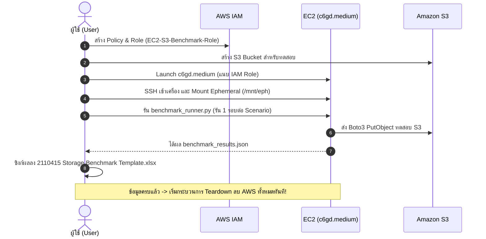

# Second Plan (Execution Plan): Storage System Performance Benchmark (Activity 7)

เอกสารฉบับนี้เป็นแผนปฏิบัติการฉบับสมบูรณ์ (Execution Plan) ที่ต่อยอดจาก [FIRST_PLAN.md](file:///C:/Users/USER/Desktop/Software_def/act7/FIRST_PLAN.md) โดยผสานพารามิเตอร์จริงจาก [2110415 Storage Benchmark Template.xlsx](file:///C:/Users/USER/Desktop/Software_def/act7/2110415%20Storage%20Benchmark%20Template.xlsx) พร้อมทั้งระบุสูตรคำนวณ, สคริปต์ Benchmark ฉบับพร้อมใช้งาน, และขั้นตอนการลบ Resource ทั้งหมดบน AWS หลังเสร็จสิ้นการเก็บข้อมูลเพื่อตัดค่าใช้จ่ายให้เหลือ $0

---

## 1. ข้อกำหนดหลักและนโยบายการทดสอบ (Core Policy & Cost Optimization)

> ### 💡 นโยบายการรันแบบรอบเดียว (Single-Trial Execution Policy)
> * **ไม่มีการรัน 3 รอบเพื่อหาค่าเฉลี่ย**: สคริปต์จะทำการทดสอบ **1 รอบต่อหนึ่งค่า $N$** (Single Run) ตามค่าใน Spreadsheet โดยตรง
> * **เหตุผล**: เพื่อลดจำนวน API Request ของ Amazon S3 (คำสั่ง `PutObject` มีค่าบริการ $0.005 ต่อ 1,000 requests) และลดระยะเวลาการทำงานของเครื่อง EC2 เพื่อประหยัดค่าใช้จ่ายและเวลาของผู้ใช้อย่างสูงสุด

---

## 2. ตารางการทดลองจริงจาก Spreadsheet (Experiment Matrix)

จากการวิเคราะห์ไฟล์ [2110415 Storage Benchmark Template.xlsx](file:///C:/Users/USER/Desktop/Software_def/act7/2110415%20Storage%20Benchmark%20Template.xlsx) พารามิเตอร์รอบการทดลอง ($N$) ถูกกำหนดไว้ดังนี้:

| ขนาดไฟล์ (File Size) | ขนาดในหน่วย Bytes | รอบการทดลอง ($N$) สำหรับ **EBS** และ **Ephemeral** | รอบการทดลอง ($N$) สำหรับ **S3** |
|---|---|---|---|
| **2 KiB** | $2,048\text{ Bytes}$ | 32,768 / 65,536 / 131,072 / 262,144 / 393,216 | **512 / 1,024 / 2,048 / 4,096 / 6,144** |
| **256 KiB** | $262,144\text{ Bytes}$ | 512 / 1,024 / 2,048 / 4,096 / 6,144 | 512 / 1,024 / 2,048 / 4,096 / 6,144 |
| **1 MiB** | $1,048,576\text{ Bytes}$ | 128 / 256 / 512 / 1,024 / 1,536 | 128 / 256 / 512 / 1,024 / 1,536 |
| **128 MiB** | $134,217,728\text{ Bytes}$ | 1 / 2 / 4 / 8 / 12 | 1 / 2 / 4 / 8 / 12 |

*ข้อสังเกตสำคัญ*: ที่ขนาด 2 KiB บน S3 จำนวนรอบจะลดลงเหลือ $512 - 6,144$ รอบ (แทนที่จะเป็น $393,216$ รอบเหมือน Disk Storage) เนื่องจาก S3 ติดต่อผ่านเครือข่าย HTTP REST API ซึ่งมีค่า Network Round-Trip Overhead สูง การลดรอบลงจะช่วยให้การทดลองเสร็จสิ้นในเวลาที่เหมาะสมและประหยัดค่า S3 PUT API อย่างมาก

---

## 3. ที่มาและสูตรการคำนวณใน Spreadsheet (Formulas & Metric Derivations)

ในแต่ละตารางจะมี 3 คอลัมน์ที่ต้องคำนวณและกรอกค่า:

```mermaid
flowchart LR
    A["Raw Benchmark Script (test_fs.py / test_s3.py)"] -->|วัดเวลา t1 - t0| B["Total write time (s)"]
    B -->|Total write time / N| C["Write time per file (s)"]
    B -->|Total Bytes / (Total write time * 10^6)| D["Bandwidth (MB/s)"]
    C -->|File Size (MB) / Write time per file| D
```

### 3.1 Total write time (s)
* **ที่มา**: ได้จากการจับเวลาการทำงานจริงของสคริปต์ Benchmark บน EC2
* **วิธีการวัด**: สคริปต์บันทึกเวลา Wall-clock ก่อนเริ่มลูปและหลังจบลูป $N$ ไฟล์:
  $$\text{Total write time } (s) = t_1 - t_0$$

### 3.2 Write time per file (s)
* **ที่มา**: เวลาเฉลี่ยหรือ Latency ในการเขียนไฟล์ 1 ไฟล์
* **สูตรการคำนวณ**:
  $$\text{Write time per file (s)} = \frac{\text{Total write time (s)}}{\text{Number of iterations } (N)}$$

### 3.3 Bandwidth (MB/s) หรือ Throughput
* **ที่มา**: อัตราความเร็วในการถ่ายโอนข้อมูลที่เขียนลงสู่พื้นที่จัดเก็บต่อวินาที
* **สูตรการคำนวณ (Formula)**:
  $$\text{Bandwidth (MB/s)} = \frac{\text{Total Bytes Written (Bytes)}}{\text{Total write time (s)} \times 10^6} = \frac{\text{File Size (Bytes)} \times N}{\text{Total write time (s)} \times 10^6}$$
  หรือคำนวณจากเวลาต่อไฟล์:
  $$\text{Bandwidth (MB/s)} = \frac{\text{File Size (in MB)}}{\text{Write time per file (s)}}$$
  *(หมายเหตุ: ในระบบ SI มาตรฐานของ Throughput $1\text{ MB} = 10^6 = 1,000,000\text{ Bytes}$ หากต้องการในหน่วยฐานสอง $\text{MiB/s}$ ให้หารด้วย $1,048,576$ โค้ดอัตโนมัติจะคำนวณตามมาตรฐานหัวตาราง MB/s)*

---

## 4. โค้ด Benchmark และการจัดการข้อมูลอัตโนมัติ (Automation Scripts)

โปรแกรมทั้งหมดจะถูกสร้างขึ้นในโฟลเดอร์โปรเจกต์:

### 4.1 `test_fs.py` (สำหรับ EBS และ Ephemeral NVMe)
* เขียนไฟล์แบบ Sequential ลงใน POSIX Filesystem
* รองรับ Argument: `<source_data> <target_dir> <n>`
* โค้ดจะอ่านข้อมูลต้นทางลง Memory ครั้งเดียว แล้ววนลูปสร้างไฟล์ใหม่ที่ไม่ซ้ำกัน $N$ ไฟล์ และจับเวลาอย่างแม่นยำ

### 4.2 `test_s3.py` (สำหรับ Amazon S3)
* อัปโหลด Object ผ่าน Boto3 API (`put_object`)
* รองรับ Argument: `<source_data> <bucket_name> <n>`
* ดึงสิทธิ์ชั่วคราวผ่าน IAM Role (Instance Profile) โดยอัตโนมัติ ไม่ต้องใส่คีย์

### 4.3 `benchmark_runner.py` (Runner รันการทดลองอัตโนมัติแบบรอบเดียว)
* รันการทดสอบครบทุกระบบและทุกขนาดไฟล์ตาม Matrix ในข้อ 2
* **Auto-Cleanup**: สั่งลบไฟล์ทดสอบทันทีหลังจบรอบนั้น ๆ เพื่อไม่ให้พื้นที่เต็มและไม่ส่งผลต่อผลการทดลองรอบถัดไป
* บันทึกผลลัพธ์เป็นไฟล์ `benchmark_results.json`

### 4.4 `sync_to_excel.py` (เขียนผลลัพธ์ลง Spreadsheet อัตโนมัติ)
* อ่านค่าจาก `benchmark_results.json` แล้วเปิดไฟล์ [2110415 Storage Benchmark Template.xlsx](file:///C:/Users/USER/Desktop/Software_def/act7/2110415%20Storage%20Benchmark%20Template.xlsx) เพื่อกรอกค่า `Total write time`, `Write time per file`, และ `Bandwidth (MB/s)` ลงในเซลล์ที่ถูกต้องโดยอัตโนมัติ

---

## 5. คู่มือขั้นตอนการ Setup และรัน Benchmark บน AWS EC2



### ขั้นตอนที่ 1: เตรียม IAM Role (Least Privilege)
สร้าง Policy ชื่อ `Act7-S3-LeastPrivilege-Policy`:
```json
{
  "Version": "2012-10-17",
  "Statement": [
    {
      "Sid": "BenchmarkS3Permissions",
      "Effect": "Allow",
      "Action": [
        "s3:PutObject",
        "s3:GetObject",
        "s3:DeleteObject",
        "s3:ListBucket"
      ],
      "Resource": [
        "arn:aws:s3:::act7-storage-benchmark-*",
        "arn:aws:s3:::act7-storage-benchmark-*/*"
      ]
    }
  ]
}
```
สร้าง Role ชื่อ `EC2-S3-Benchmark-Role` โดยเลือก Use Case: **EC2** และแนบ Policy นี้

### ขั้นตอนที่ 2: Launch EC2 Instance
* **Instance Type**: `c6gd.medium` (ARM64 Ubuntu 24.04 LTS)
* **IAM Instance Profile**: แนบ `EC2-S3-Benchmark-Role`
* **Storage**: EBS gp3 60 GB + Direct NVMe Instance Store (แนบมาพร้อมเครื่อง)
* **Key Pair**: บันทึกไฟล์ `.pem`

### ขั้นตอนที่ 3: เตรียม Storage Mount บน EC2
SSH เข้าเครื่อง:
```bash
ssh -i <your-key.pem> ubuntu@<ec2-public-ip>
```
Format และ Mount Ephemeral NVMe:
```bash
sudo mkfs.ext4 /dev/nvme1n1
sudo mkdir -p /mnt/eph
sudo mount -t ext4 /dev/nvme1n1 /mnt/eph/
sudo chown -R ubuntu:ubuntu /mnt/eph/
mkdir -p ~/ebs_test
```

### ขั้นตอนที่ 4: รันการทดลอง
ติดตั้ง Python และ Dependencies:
```bash
sudo apt update && sudo apt install -y python3-pip python3-venv git
```
อัปโหลดสคริปต์และไฟล์ทดสอบขึ้น EC2 แล้วสั่งรัน:
```bash
python3 benchmark_runner.py --bucket-name <your-s3-bucket-name>
```

---

## 6. การลบ Resource ทั้งหมดบน AWS หลังทำเสร็จ (Total Resource Teardown Protocol)

### 6.1 คำตอบ: ทำ Spreadsheet ครบแล้ว ลบได้เลยหรือไม่?
> **สามารถลบ Resource ทั้งหมดได้ทันที 100%!**
> 
> เนื่องจากเมื่อกรอกตัวเลขดิบลงในตาราง Excel ครบแล้ว ข้อมูลผลการทดลองทั้งหมดจะถูกเก็บไว้อย่างถาวรในเครื่องคอมพิวเตอร์ของคุณ การสร้างกราฟเปรียบเทียบและการเขียนรายงานตอบคำถาม 7 ข้อสามารถทำแบบ Offline บนเครื่อง Local ได้ทั้งหมด การลบทันทีจะช่วยตัดค่าใช้จ่ายคงค้างบน AWS ให้เหลือ **$0**

### 6.2 ตารางสรุปสิ่งที่เราสร้าง และสิ่งที่ต้องลบ

| สิ่งที่สร้างขึ้น (Created Resource) | สถานะค่าใช้จ่าย | วิธีการลบ (Deletion Action) | คำสั่งหรือขั้นตอน |
|---|---|---|---|
| **EC2 Instance (`c6gd.medium`)** | คิดเงินรายชั่วโมง | **Terminate Instance** | ทำลายเครื่องทิ้งทันที |
| **EBS Volume (gp3 60GB)** | คิดเงินราย GB-เดือน | **Auto-deleted** | จะถูกลบอัตโนมัติเมื่อ Terminate EC2 (Default: DeleteOnTermination) |
| **Ephemeral NVMe (59GB)** | รวมใน EC2 | **Auto-wiped** | ข้อมูลและไดรฟ์จะถูกล้างทิ้งทันทีเมื่อ VM ดับ |
| **S3 Bucket & Objects** | คิดเงินราย GB + Request | **Empty Bucket แล้ว Delete Bucket** | ต้องลบ Objects ทั้งหมดออกก่อน แล้วสั่ง Delete Bucket |
| **Security Group** | ฟรี | **Delete Security Group** | ลบหลังจาก EC2 Terminate สำเร็จ |
| **Key Pair (`.pem`)** | ฟรี | **Delete Key Pair** | ลบออกจาก EC2 Console |
| **IAM Role & Policy** | ฟรี | **Detach Policy แล้ว Delete Role + Policy** | ถอด Policy ออกจาก Role ก่อน แล้วลบทั้งคู่ |

---

### 6.3 ขั้นตอนการลบแบบ Step-by-Step

#### ตัวเลือก A: ลบผ่าน AWS Management Console (GUI)
1. **ลบ S3 Bucket**:
   * เข้าสู่ **Amazon S3 Console** -> คลิกเลือกชื่อ Bucket ของเรา
   * คลิกปุ่ม **Empty** -> พิมพ์ข้อความ `permanently delete` เพื่อยืนยันการลบ Object ทั้งหมด
   * คลิกปุ่ม **Delete** -> พิมพ์ชื่อ Bucket เพื่อลบ Bucket ทิ้งอย่างถาวร
2. **Terminate EC2 Instance**:
   * เข้าสู่ **EC2 Console** -> เมนู **Instances**
   * ติ๊กเลือกอินสแตนซ์ `c6gd.medium`
   * คลิกเมนู **Instance state** -> เลือก **Terminate instance** -> ยืนยันการ Terminate
   * *(EBS Volume และ Ephemeral NVMe จะถูกลบทำลายทิ้งอัตโนมัติ)*
3. **ลบ Security Group & Key Pair**:
   * รอจน EC2 เปลี่ยนสถานะเป็น `Terminated`
   * ไปที่เมนู **Security Groups** -> เลือก SG ที่สร้างขึ้น -> คลิก **Actions** -> **Delete security group**
   * ไปที่เมนู **Key Pairs** -> เลือก Key pair -> คลิก **Actions** -> **Delete**
4. **ลบ IAM Role & Policy**:
   * เข้าสู่ **IAM Console** -> ไปที่เมนู **Roles**
   * ค้นหา `EC2-S3-Benchmark-Role` -> ติ๊กเลือกแล้วกด **Delete**
   * ไปที่เมนู **Policies** -> ค้นหา `Act7-S3-LeastPrivilege-Policy` -> ติ๊กเลือกแล้วกด **Delete**

#### ตัวเลือก B: ลบผ่าน AWS CLI (คำสั่ง Terminal ครั้งเดียว)
```bash
# 1. ลบไฟล์ทั้งหมดใน S3 และลบ Bucket
aws s3 rm s3://<your-bucket-name> --recursive
aws s3 rb s3://<your-bucket-name>

# 2. Terminate EC2 Instance
aws ec2 terminate-instances --instance-ids <your-instance-id>

# 3. ลบ Key Pair
aws ec2 delete-key-pair --key-name <your-key-pair-name>

# 4. ลบ Security Group (รอให้ Instance Terminate เสร็จก่อน)
aws ec2 delete-security-group --group-id <your-security-group-id>

# 5. ลบ IAM Role และ Policy
aws iam remove-role-from-instance-profile --instance-profile-name EC2-S3-Benchmark-Role --role-name EC2-S3-Benchmark-Role
aws iam delete-instance-profile --instance-profile-name EC2-S3-Benchmark-Role
aws iam detach-role-policy --role-name EC2-S3-Benchmark-Role --policy-arn arn:aws:iam::<account-id>:policy/Act7-S3-LeastPrivilege-Policy
aws iam delete-role --role-name EC2-S3-Benchmark-Role
aws iam delete-policy --policy-arn arn:aws:iam::<account-id>:policy/Act7-S3-LeastPrivilege-Policy
```

---

## 7. การประมวลผลผลลัพธ์แบบ Offline (Local Data Analysis)

หลังจาก Teardown ลบ Cloud Resources เรียบร้อยแล้ว:
1. นำข้อมูลจากตาราง [2110415 Storage Benchmark Template.xlsx](file:///C:/Users/USER/Desktop/Software_def/act7/2110415%20Storage%20Benchmark%20Template.xlsx) มารันสคริปต์ `plot_graphs.py` บนเครื่อง Local เพื่อสร้างกราฟ 2 ชุด:
   * **Graph 1**: Total Bytes Written vs Throughput (MB/s) สำหรับแต่ละ Storage
   * **Graph 2**: Number of Files (Iterations) vs Performance
2. ตอบคำถามท้ายกิจกรรมทั้ง 7 ข้ออย่างครบถ้วนตามทฤษฎีสถาปัตยกรรมคอมพิวเตอร์
